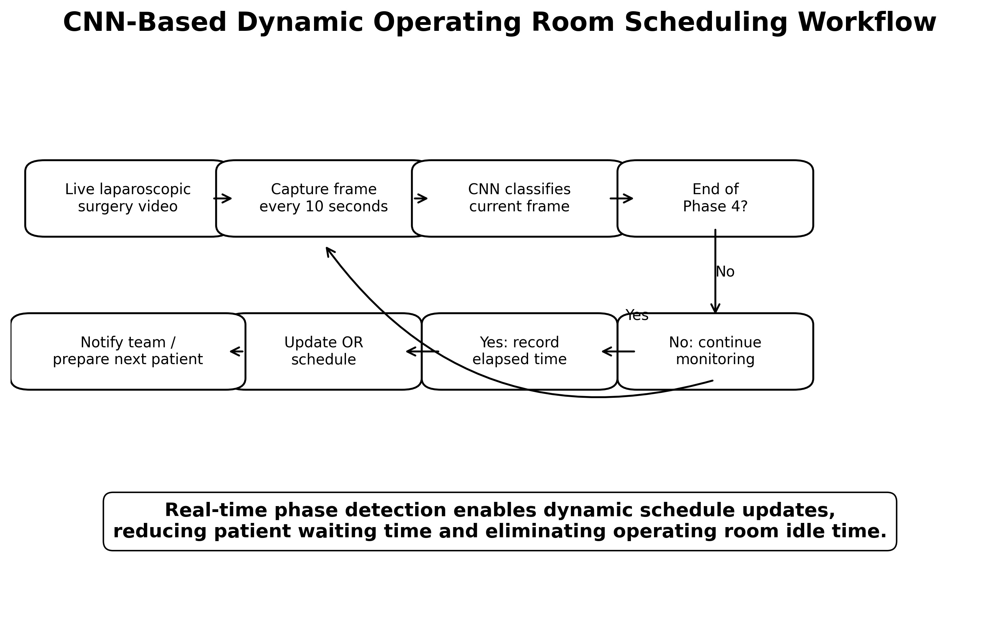
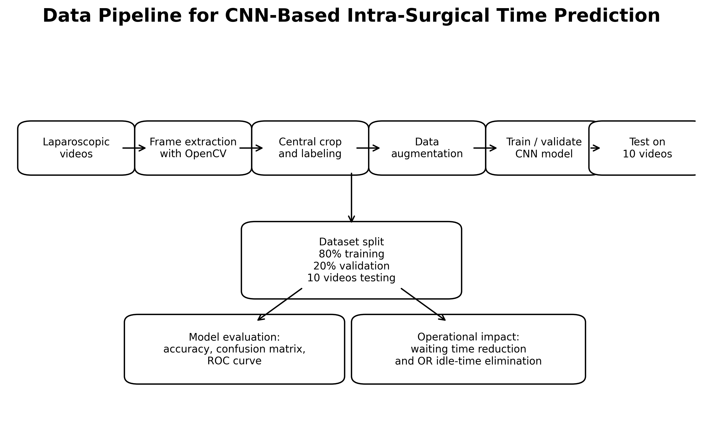
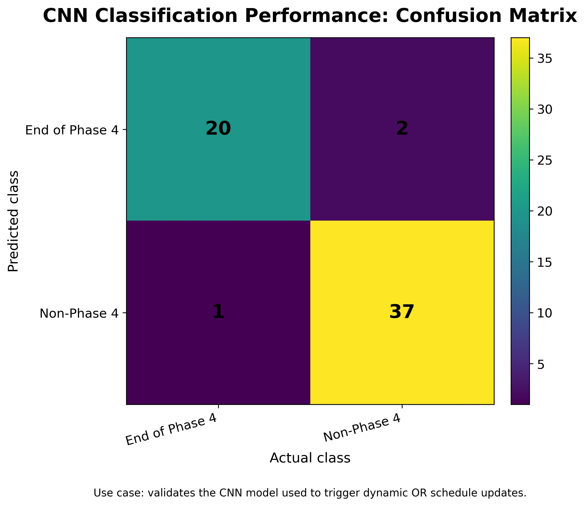
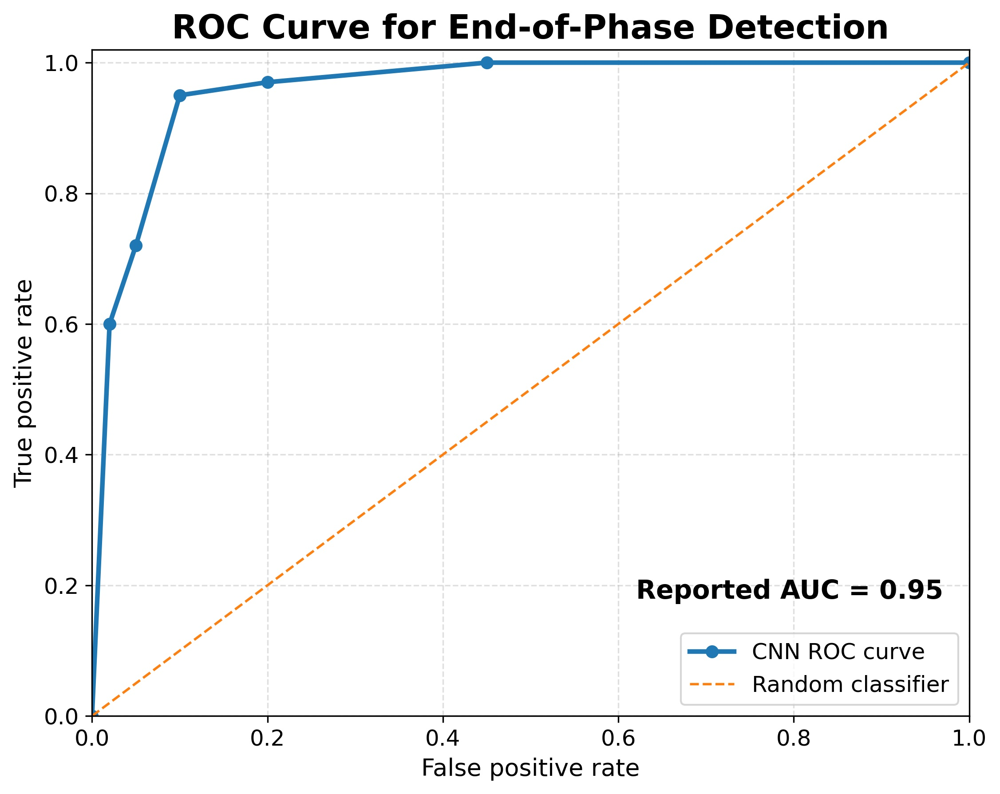
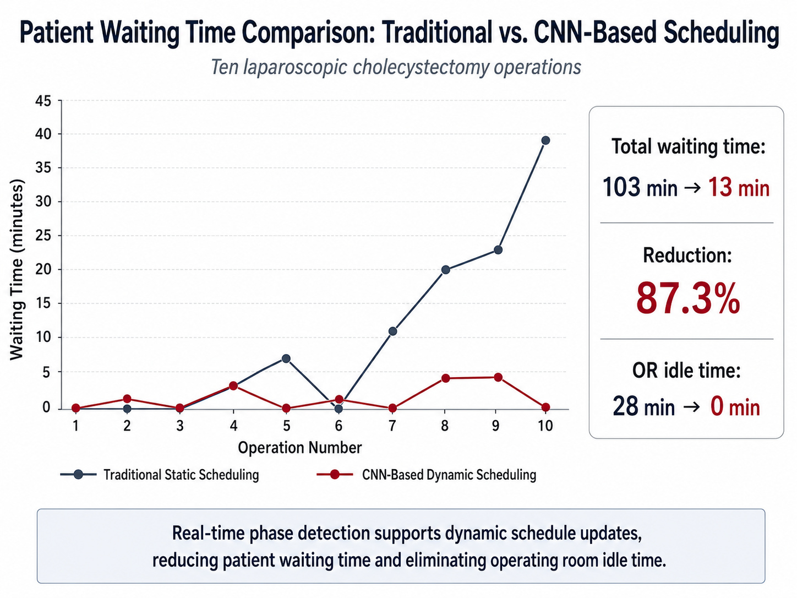

# Healthcare Operations Transformation: CNN-Based Dynamic Operating Room Scheduling

## Project overview

This repository presents a healthcare operations analytics case study based on the published paper:

**Ramadan, S., Abu-Shams, M., Al-Dahidi, S., Odeh, I., & Almasarwah, N. (2025). A Data-Driven Approach for Predicting Remaining Intra-Surgical Time and Enhancing Operating Room Efficiency. Journal of Industrial Engineering and Management, 18(1), 145–166. https://doi.org/10.3926/jiem.8543**

The project demonstrates how **computer vision, convolutional neural networks (CNNs), and dynamic scheduling logic** can support real-time operating room (OR) scheduling decisions.

Traditional OR scheduling often relies on fixed historical surgery durations. This can create patient waiting time, operating room idle time, schedule disruption, and inefficient resource use. The proposed approach uses laparoscopic surgical video frames to detect the end of **Gallbladder Dissection Phase 4**, enabling the OR schedule to be updated dynamically.

## Business problem

Operating rooms are among the most expensive and resource-intensive units in a hospital. When surgery durations are uncertain, static schedules may lead to:

- Patient waiting time
- Operating room idle time
- Inefficient use of staff and anesthesia resources
- Cascading delays across later surgeries
- Lower patient satisfaction

The business question addressed in this project is:

> Can real-time surgical phase detection improve OR scheduling performance compared with traditional static scheduling?

## Proposed solution

The study developed a CNN-based approach that uses laparoscopic video frames to classify whether the surgery has reached the end of Phase 4. Once Phase 4 is detected, the system can trigger a schedule update and help prepare the next patient and OR resources.



## Data and methodology

The study used laparoscopic cholecystectomy videos. The dataset included videos from Al-Salt Hospital in Jordan and the Cholec80 dataset. The model-development process included:

1. Extracting video frames using Python OpenCV
2. Cropping the central region of frames
3. Creating binary labels for end-of-Phase-4 detection
4. Applying data augmentation to increase training diversity
5. Training and validating a CNN model
6. Testing the trained model on ten held-out surgeries
7. Comparing traditional static scheduling with CNN-based dynamic scheduling



## Model evaluation

The CNN model was evaluated using accuracy, specificity, sensitivity, precision, negative predictive value, a confusion matrix, and an ROC curve. The paper reports an AUC value of 0.95, indicating strong classification performance for detecting the end of Phase 4.





## Business impact

The dynamic scheduling approach substantially improved the test schedule compared with traditional static scheduling.

Key reported outcomes:

- Total patient waiting time decreased from **103 minutes to 13 minutes**
- Patient waiting time decreased by **87.3%**
- Operating room idle time decreased from **28 minutes to 0 minutes**



## Repository contents

```text
healthcare_or_dynamic_scheduling/
│
├── README.md
│
├── docs/
│   ├── executive_summary.md
│   ├── methodology.md
│   ├── business_impact.md
│   └── limitations_and_future_work.md
│
├── figures/
│   ├── project11_waiting_time_comparison.jpg
│   ├── 01_cnn_dynamic_scheduling_workflow.jpg
│   ├── 02_model_training_accuracy_summary.jpg
│   ├── 03_confusion_matrix_redesigned.jpg
│   ├── 04_roc_curve_auc_095.jpg
│   └── 05_data_pipeline_framework.jpg
│
├── data/
│   ├── README.md
│   ├── sample_schedule_data.csv
│   └── sample_phase4_prediction_results.csv
│
└── notebooks/
    └── cnn_or_scheduling_demo.ipynb
```

## How to use this repository

1. Start with the README for the case-study summary.
2. Review `docs/executive_summary.md` for the non-technical business explanation.
3. Review `docs/methodology.md` for the data and modeling workflow.
4. Use `data/sample_schedule_data.csv` to reproduce the business-impact calculations.
5. Open `notebooks/cnn_or_scheduling_demo.ipynb` to calculate waiting-time reduction and create simple charts.

## Disclaimer

This repository is prepared for educational, research, and portfolio demonstration purposes. It does not include patient-identifiable data or raw surgical videos. It is not intended for direct clinical deployment without institutional validation, clinical review, and appropriate regulatory approval.
